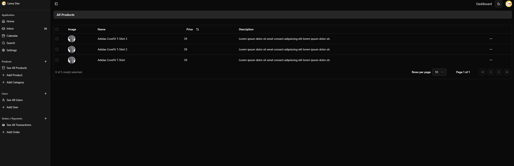

# Admin

Painel administrativo para gerenciamento da plataforma, construído com Next.js 15 e React 19.

## Tecnologias

- **Next.js 15** - Framework React com Turbopack
- **React 19** - Biblioteca de UI
- **TypeScript** - Tipagem estática
- **Tailwind CSS 4** - Estilização
- **Clerk** - Autenticação
- **TanStack Query** - Gerenciamento de estado do servidor
- **TanStack Table** - Tabelas avançadas
- **React Hook Form + Zod** - Formulários e validação
- **Radix UI** - Componentes acessíveis
- **Recharts** - Gráficos e visualizações

## Pré-requisitos

- Node.js
- pnpm
- Variáveis de ambiente configuradas

## Dependências do Workspace

Este projeto faz parte de um monorepo e depende dos seguintes pacotes internos:

- `@repo/types` - Tipos compartilhados
- `@repo/typescript-config` - Configuração TypeScript compartilhada
- `@repo/eslint-config` - Configuração ESLint compartilhada

## Instalação

```bash
pnpm install
```

## Scripts

| Comando | Descrição |
|---------|-----------|
| `pnpm dev` | Inicia o servidor de desenvolvimento com Turbopack (porta 3003) |
| `pnpm build` | Compila o projeto para produção |
| `pnpm start` | Inicia o servidor de produção |
| `pnpm lint` | Executa o linter |
| `pnpm check-types` | Verifica erros de tipagem TypeScript |

## Configuração

Crie um arquivo `.env.local` na raiz do projeto:

```env
NEXT_PUBLIC_CLERK_PUBLISHABLE_KEY=...
CLERK_SECRET_KEY=...
NEXT_PUBLIC_API_URL=...
```

## Componentes UI

O projeto utiliza componentes do Radix UI com as seguintes primitivas disponíveis:

- Avatar, Checkbox, Dialog, Dropdown Menu
- Hover Card, Label, Popover, Progress
- Scroll Area, Select, Separator, Tooltip, Collapsible

## Estrutura

```
src/
├── app/            # App Router (páginas e layouts)
├── components/     # Componentes React
├── hooks/          # Custom hooks
├── lib/            # Utilitários e configurações
└── styles/         # Estilos globais
```


